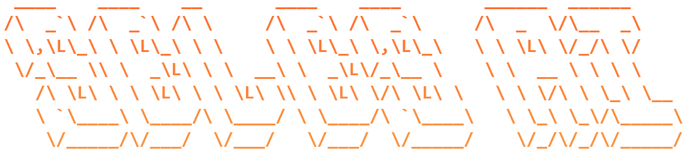
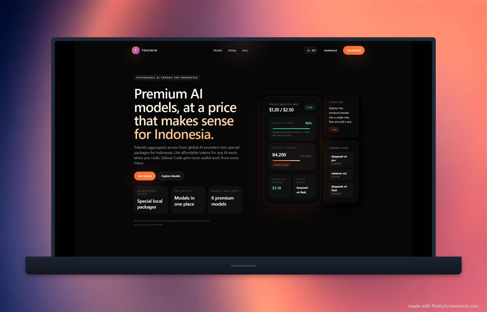

<div align="center">



**The AI coding agent built to finish.**

[Documentation](https://selesaiintech.github.io/selesai-code/) · [Get started](https://selesaiintech.github.io/selesai-code/get-started/) · [Get model access on token.in](https://token.selesai.in) · [Report an issue](https://github.com/SelesaiInTech/selesai-code/issues)

[](https://www.npmjs.com/package/@selesai/code)
[](https://selesaiintech.github.io/selesai-code/)
[](https://www.typescriptlang.org/)
[](https://github.com/earendil-works/pi)

</div>

Selesai is a terminal-first **AI coding agent** that takes software tasks from prompt to verified result. It is a maintained, extension-first fork of the [Pi coding agent](https://github.com/earendil-works/pi), with subagents, adaptive workflows, live research, recovery tools, a richer TUI, and **32 built-in skills** shipped together in one install.

Use your preferred model provider, connect a local or OpenAI-compatible endpoint, or get a ready-to-use token from **[token.in](https://token.selesai.in)**. Selesai keeps Pi's small, hackable core while reducing the setup and extension work needed before an agent can be productive.

| | |
| --- | --- |
| **Ready out of the box** | One package bundles coordinated extensions, tools, themes, and 32 skills across 9 meaningful categories. |
| **Delegates and parallelizes** | Focused subagents can research, review, build, or run independent workstreams with foreground, background, parallel, and chained execution. |
| **Adapts to the task** | The workflow chooses the smallest useful path—from a direct edit to reconnaissance, implementation, review, fixes, and validation. |
| **Researches with current sources** | Built-in web research, public GitHub code search, and interactive questions help the agent resolve uncertainty before it acts. |
| **Recovers without losing momentum** | Rewind, undo, handoff, session trees, checkpoints, context reminders, and cross-session coordination keep long tasks manageable. |
| **Makes token usage visible** | Live throughput, usage, cost reconciliation, compact output, and handoff tooling help use model context deliberately. |

---

## Quick install

Install the latest published package:

```sh
npm install -g @selesai/code
selesai
```

Run once without a global install:

```sh
npx @selesai/code
```

Or install the latest `main` branch directly from GitHub:

```sh
npm install -g github:SelesaiInTech/selesai-code
```

Start with a task:

```sh
selesai "Explain this repository and tell me how to run its checks"
```

Run a non-interactive request:

```sh
selesai -p "Review the current git diff without editing files"
```

Selesai stores user state in `~/.selesai/agent/` and project-local settings and resources in `./.selesai/`.

📖 **[Read the full getting-started guide →](https://selesaiintech.github.io/selesai-code/get-started/)**

---

## Need a token? Use token.in

Selesai works with multiple model providers and custom endpoints. If you want model access without setting up a separate provider account first, create a token on **[token.in](https://token.selesai.in)**, the Selesai model-access platform.

<p align="center">
  <a href="https://token.selesai.in">
    
  </a>
</p>

On the first interactive launch, Selesai can open the token.in dashboard and guide you through connecting the token. You can manage more than one account later from the TUI:

| Command | What it does |
| --- | --- |
| `/tokenin add` | Add a token.in account. The first account becomes active automatically. |
| `/tokenin switch` | Switch the active account. |
| `/tokenin remove` | Remove a saved, non-active account. |
| `/tokenin usage` | Show spend, budget, remaining quota, and reset time. |

Saved accounts support automatic failover for authentication, rate-limit, and quota failures. Credentials stay in Selesai's local auth storage; never commit `auth.json`, `tokenin-auth.json`, or a token to source control.

📖 **[Token onboarding guide →](https://selesaiintech.github.io/selesai-code/capabilities/workspace/tokenin-onboarding/)**

---

## 32 built-in skills, 9 meaningful categories

Skills ship inside `@selesai/code` and are discovered when Selesai starts. Invoke a skill inline with `$skill-name`, or use the matching `/skill:name` command in the TUI.

### 🎨 Frontend design & UI

- `design-taste-frontend` / `design-taste-frontend-v1` — anti-slop frontend design; v2 is the default and v1 remains available for legacy workflows.
- `high-end-visual-design` — agency-grade visual design standards.
- `minimalist-ui` / `industrial-brutalist-ui` — focused aesthetic systems for two distinct interface directions.
- `gpt-taste` — UX/UI and GSAP motion engineering.
- `redesign-existing-projects` — upgrade the visual quality of an existing site or app.
- `stitch-design-taste` — create design-system documentation for Google Stitch.
- `web-design-guidelines` — review UI quality, compliance, and accessibility.

### 🖼️ Image generation & visual direction

- `brandkit` — brand identity boards, logo systems, and visual worlds.
- `imagegen-frontend-web` — section-by-section website reference images.
- `imagegen-frontend-mobile` — mobile app screen concepts.
- `image-to-code` — generate a design direction and implement it as code.

### 📋 Planning & orchestration

- `planger` — decompose work into subagent-ready plans.
- `implanger` — execute planger-style plans.
- `workflow` — adaptive multi-stage implementation orchestration.
- `pi-subagents` — delegation patterns for parallel, asynchronous, and chained work.

### 🧹 Code simplicity — the ponytail family

- `ponytail` — the smallest solution that actually works.
- `ponytail-review` — review a diff for unnecessary complexity.
- `ponytail-audit` — audit a whole repository for bloat.
- `ponytail-debt` — turn `ponytail:` comments into a debt ledger.
- `ponytail-gain` — maintain an impact scoreboard.
- `ponytail-help` — ponytail reference card.

### 🛠️ Codebase quality

- `improve-codebase` — inspect and improve architecture, maintainability, and overall codebase quality.

### ✅ Completion & output discipline

- `unlazy` — acceptance gates, depth trees, and finish-the-job enforcement.
- `full-output-enforcement` — prevent truncation and placeholder output in generated code.

### 📤 Handoff & context transfer

- `handoff` / `handoff-text` — compact a long conversation into a continuation document.
- `selesai-handoff` — hand work to a fresh background agent.

### 🎤 Requirement elicitation

- `grill-me` — stress-test requirements and design decisions through a focused interview.
- `batch-grill-me` — ask the same hard questions in parallel rounds.

### 🤖 Automation

- `agent-browser` — browser and Electron automation, scraping, and QA workflows.

---

## What Selesai adds to Pi

### Built-in delegation and orchestration

`pi-subagents` is adapted to the Selesai runtime and includes focused agent roles such as `architect`, `builder`, `commentator`, `explorer`, `recapper`, and `researcher`. Agent definitions can control models, tools, skills, output formats, budgets, fallbacks, and worktree isolation.

The parent agent stays responsible for decisions while delegated agents contribute bounded work. Delegates can report progress, request clarification from their supervisor, be steered or interrupted, and return structured artifacts or transcripts.

```text
Ask the architect to challenge this plan before we implement it.
Run parallel commentator agents for correctness, tests, and unnecessary complexity.
Have the builder implement this plan, then review the result.
```

### Adaptive implementation workflow

The bundled `workflow` skill is a task-sensitive implementation policy, not a rigid slash-command pipeline. A small change can stay direct. A riskier change can add reconnaissance, research, a single writer, targeted review, fixes, and validation without turning every task into a ceremony.

Invoke it with `$workflow`, or ask Selesai to orchestrate the implementation in plain language.

### Research and interactive decisions

- **Web agent** — current web research with search, readable extraction, source ranking, and targeted browser escalation.
- **grep.app** — public GitHub code search and source retrieval without leaving the agent.
- **Question UI** — single-select, multi-select, freeform, image, and contextual questions inside the TUI.

### Recovery and continuity

- **Rewind** — git-backed file checkpoints that survive forks and session navigation.
- **Undo** — turn-level recovery for edits, writes, and detected mutating shell commands.
- **Handoff** — start a clean continuation session with the important context carried forward.
- **Context reminder** — warn before a conversation becomes too large for reliable work.
- **Intercom** — local communication between named Selesai sessions.
- **Hermes memory** — persistent memory and recall across sessions.

### A richer terminal workspace

The interactive terminal uses fullscreen TUI mode by default, keeping the editor, status line, and widgets fixed while the conversation scrolls in its own viewport. The bundled workspace also adds:

- a configurable Starship-inspired status line and editor surfaces via `/zentui`;
- live tokens-per-second tracking for the main model and subagents;
- token, context, runtime, cost, working-directory, and git-state visibility;
- multiline editing, file completion, images, queued steering, and interactive selectors.

Switch to inline terminal output at any time with `--tui-mode regular` or the `TUI mode` entry in `/settings`.

### In-tree, coordinated extensions

Selesai carries the extensions that define its experience in [`src/extensions/`](src/extensions/), adapts them to the Selesai host, tests them with the application, and ships them with each release. This makes the core stack visible and reviewable in one repository and avoids requiring a long list of unrelated extension installs.

Bundling reduces setup and extension supply-chain exposure; it does not remove dependency or model risk. Review extension and dependency changes as you would for any local coding agent.

---

## Pi-compatible core

Selesai retains Pi's core capabilities:

- terminal tools for reading, searching, editing, writing, and running commands;
- multiple model providers, API keys, OAuth, thinking levels, image input, retries, and custom endpoints;
- persistent sessions with resume, fork, tree navigation, compaction, import, and export;
- interactive, print, JSON event-stream, and RPC modes;
- TypeScript extensions, skills, prompt templates, themes, packages, and an embeddable Node.js SDK;
- project trust and configurable resource loading.

Selesai is a local agent and runs with the permissions of the user who starts it. Project trust controls loading of project resources; it is not a sandbox. Use a container, VM, or other operating-system isolation for untrusted or unattended work.

📖 **[Security guide →](docs/security.md)**

---

## Everyday commands

| Action | Command |
| --- | --- |
| Start the interactive TUI | `selesai` |
| Start with a task | `selesai "Implement the requested change and run the relevant tests"` |
| Print a response and exit | `selesai -p "Summarize this repository"` |
| Continue the latest session | `selesai -c` |
| Browse saved sessions | `selesai -r` |
| Run without saving a session | `selesai --no-session` |
| Choose a provider and model | `selesai --provider <provider> --model <model>` |
| List available models | `selesai --list-models` |
| Update Selesai | `selesai update --self` |

Inside the TUI, type `/` for command completion. Common commands include `/model`, `/settings`, `/resume`, `/tree`, `/fork`, `/compact`, `/tokenin`, `/export`, `/reload`, and `/hotkeys`.

---

## Documentation

The documentation is available in both English and Bahasa Indonesia at **[selesaiintech.github.io/selesai-code](https://selesaiintech.github.io/selesai-code/)**.

| Section | What it covers |
| --- | --- |
| [Get started](https://selesaiintech.github.io/selesai-code/get-started/) | Install, first run, configuration locations, and credentials. |
| [Why Selesai](https://selesaiintech.github.io/selesai-code/why-selesai/) | Evidence-backed comparison with the Pi baseline. |
| [Capabilities](https://selesaiintech.github.io/selesai-code/capabilities/) | Bundled tools, workflows, recovery features, and workspace improvements. |
| [Customization](https://selesaiintech.github.io/selesai-code/customization/) | Extension-level settings and behavior. |
| [Settings](https://selesaiintech.github.io/selesai-code/settings/) | Global and project configuration. |
| [Evidence](https://selesaiintech.github.io/selesai-code/evidence/) | Source evidence behind material capability claims. |
| [Changelog](https://selesaiintech.github.io/selesai-code/changelog/) | Release history and behavior changes. |
| [Bahasa Indonesia](https://selesaiintech.github.io/selesai-code/id/) | Indonesian documentation home. |

The repository also contains the Pi-compatible CLI, provider, model, extension, SDK, setting, session, and security references under [`docs/`](docs/).

---

## Repository map

```text
src/
  core/        agent runtime, sessions, tools, packages, and extension loading
  modes/       interactive TUI, print, JSON, and RPC modes
  extensions/  bundled Selesai extensions and tests
  skills/      32 built-in skills
  themes/      terminal themes
  defaults/    first-run settings and model catalogue

doc-web/       bilingual documentation website
docs/          Pi-compatible technical references
examples/      extension and SDK examples
test/          cross-cutting tests
```

---

## Development

Clone the repository and install dependencies:

```sh
git clone https://github.com/SelesaiInTech/selesai-code.git
cd selesai-code
npm install
```

Build and verify the CLI:

```sh
npm run build
node dist/cli.js --help
node dist/cli.js --version
npm test
```

Run from source during development:

```sh
npm run dev
```

Changes to bundled extensions belong in `src/extensions/`; the build copies them to `dist/extensions/` for the published package. Built-in skills live in `src/skills/` and are copied to `dist/skills/`.

### Documentation development

```sh
cd doc-web
npm install
npm run dev
```

Run `npm run verify` inside `doc-web/` before publishing documentation changes.

---

## Contributing

Issues and pull requests are welcome.

1. Search [existing issues](https://github.com/SelesaiInTech/selesai-code/issues) before opening a new one.
2. Keep changes focused and explain the user-visible behavior.
3. Add or update regression coverage for executable changes.
4. Run `npm run build` and the relevant tests locally.
5. Keep Selesai config paths (`~/.selesai/agent/` and `.selesai/`) aligned across code, tests, and documentation.
6. Update the bilingual documentation when a public capability or setting changes.

When changing a bundled extension, prefer the existing Selesai runtime and installed dependencies before adding another package. Preserve upstream attribution for adapted code and call out security-sensitive behavior clearly in the pull request.

---

## Acknowledgements

Selesai is built on the excellent [Pi coding agent](https://github.com/earendil-works/pi) and includes adapted, in-tree components from the broader Pi and open-source agent ecosystem. Component-level attribution and license notices remain with their respective source files and packages.

Built and maintained by [SelesaiInTech](https://github.com/SelesaiInTech).
